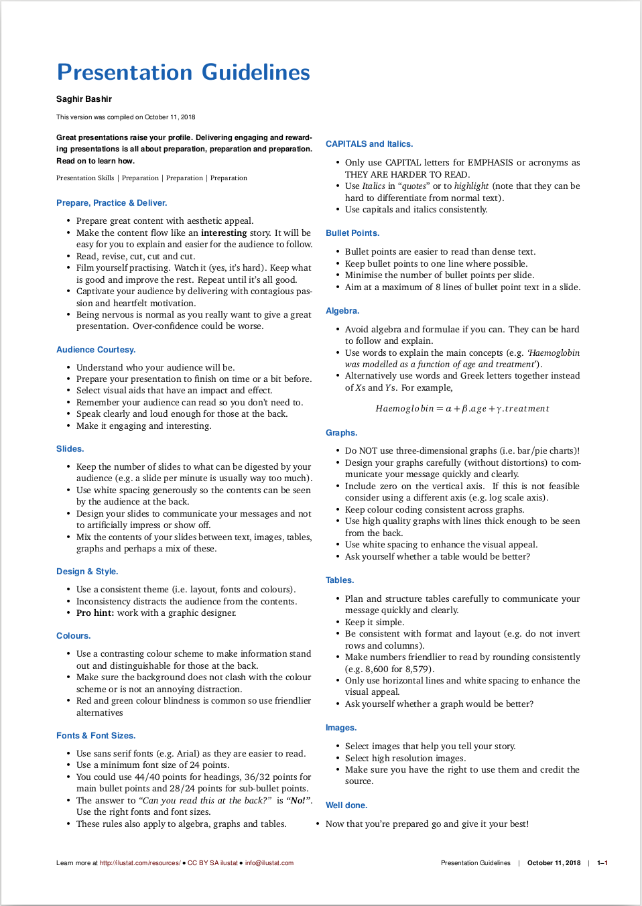

# Presentation Guidelines

**Great Presentations Raise Your Profile!**

Do you want to give great and rewarding presentations? Or just a reminder 
about what makes a great presentation? Then this one page guidance is for you:

* [Presentation Guidelines - English Version (PDF)](http://ilustat.com/shared/Presentation-Guidelines-EN.pdf)

***Organing an event, meeting, conference or workshop?*** Share the guidance with your speakers before hand.

## Nervous?

Does giving a presentation make you nervous? This following post will encourage to make friends with your nerves to give great presentations whilst raising your profile.

* [Great Presentations Raise Your Profile](http://www.ilustat.com/post/great-presentations-raise-your-profile/)

## Contributors

**A big thank you to the [reviewers and contributors](https://github.com/saghirb/Presentation-Guidelines-EN/blob/master/Contributors.md)**.
